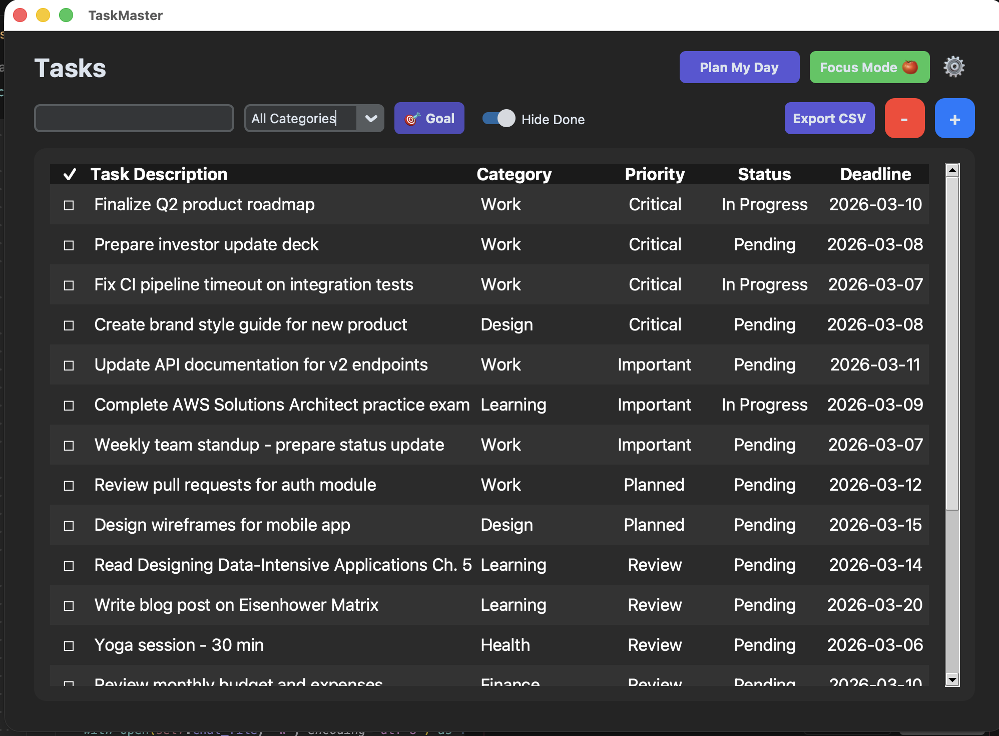
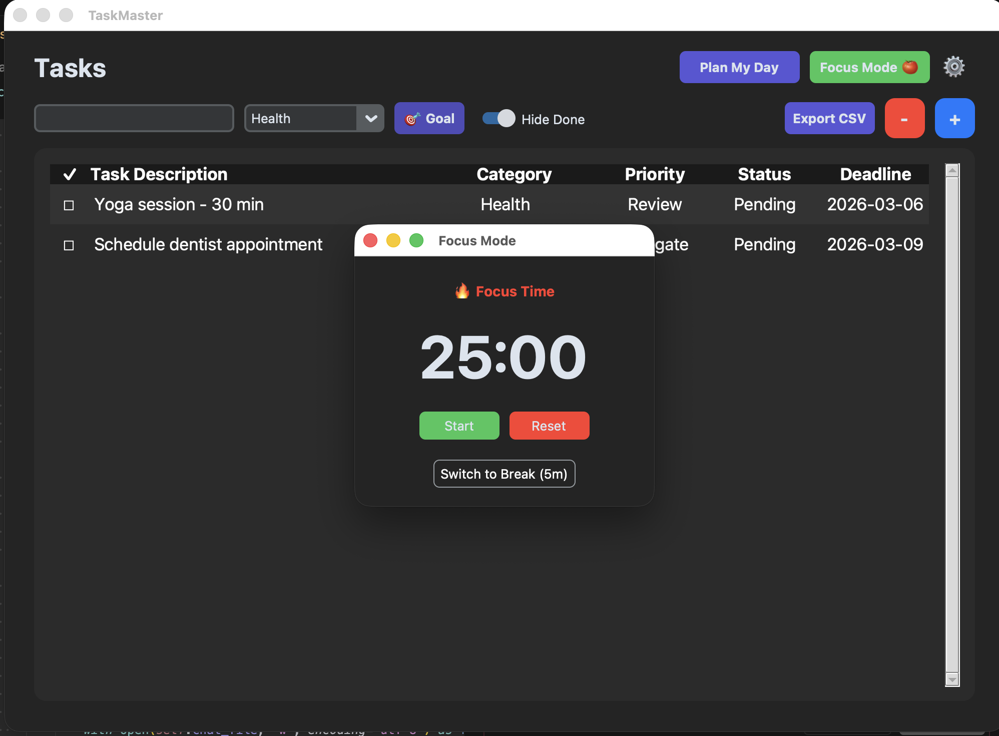

# TaskMaster ✅

<div align="center">
  
  <br>
  <b>A modern, distraction-free task manager built for focus.</b>
  <br><br>
  
  
  
</div>

---

## 📖 About
**TaskMaster** is a Python-based desktop application designed to help you organize tasks using the **Eisenhower Matrix** logic. Unlike standard to-do lists, TaskMaster automatically calculates the priority of your tasks ("Critical," "Planned," "Delegate") based on the Impact and Urgency you select.

It features a beautiful, native interface with Light/Dark theme support, local JSON storage (no cloud required), and a built-in Pomodoro timer to help you get work done.

## ✨ Key Features

* **🧠 Smart Priority Logic:** Automatically categorizes tasks based on Impact (High/Medium/Low) and Urgency.
* **🍅 Focus Mode:** Built-in **Pomodoro Timer** (25m Work / 5m Break) with a floating window that stays on top. Desktop notifications when sessions complete.
* **🔍 Search Tasks:** Real-time search bar to quickly find tasks by title.
* **📝 Task Notes:** Add detailed notes and descriptions to each task for better context.
* **🎨 Theme Support:** Switch between Light and Dark modes with full UI theming including task list.
* **📊 CSV Export:** Export all your tasks to CSV for backup or analysis in spreadsheet applications.
* **📂 Categories & Filters:** Organize tasks by category (Work, Personal, etc.) and filter the view.
* **🙈 Hide Completed:** Toggle switch to instantly clean up your view by hiding finished tasks.
* **⚙️ Settings:** View and manage your database file path, switch themes, and more.
* **🔔 Smart Notifications:** Get notified when Pomodoro sessions finish or when tasks are due today.
* **🔒 Local & Private:** All data is stored in a local JSON file. You choose the storage location on the first run.
* **📅 Calendar Integration:** Visual date picker for setting deadlines.

---

## 📸 Screenshots

*(Add screenshots of your app here. e.g. Main Window, Add Task Window, Focus Mode)*

| Main Dashboard | Focus Mode |
|:---:|:---:|
|  |  |

---

## 🚀 Installation

### For macOS Users
1.  Go to the [Releases](../../releases) page.
2.  Download `TaskMaster_Installer.dmg`.
3.  Drag the app to your **Applications** folder.
4.  **Note:** Since this app is not signed by Apple, you may need to Right-Click the app and select **Open** the first time you run it.

### For Windows Users
1.  Download `TaskMaster.exe` from Releases.
2.  Run the executable directly (No installation required).

---

## 🛠️ Development Setup

If you want to run the code source or contribute:

### 1. Clone the Repository
```bash
git clone https://github.com/YOUR_USERNAME/TaskMaster.git
cd TaskMaster
```

### 2. Create a Virtual Environment (Recommended)
```bash
python3 -m venv venv
source venv/bin/activate  # On Windows: venv\Scripts\activate
```

### 3. Install Dependencies
```bash
pip install customtkinter tinydb tkcalendar
```

### 4. Run the Application
```bash
python3 taskmaster.py
```

---

## 📋 Dependencies

* **customtkinter** - Modern UI framework
* **tinydb** - Lightweight database for task storage
* **tkcalendar** - Calendar widget for date selection

---

## 🎯 Usage

### Adding a Task
1. Click the **+** button in the main window
2. Enter task details:
   - **Task Description:** Title of your task
   - **Notes:** Additional details or context
   - **Category:** Organize by Work, Personal, Health, etc.
   - **Status:** Pending, In Progress, Completed, or On Hold
   - **Impact:** High, Medium, or Low
   - **Urgent:** Toggle to mark as urgent
   - **Deadline:** Select a date using the calendar picker
3. Click **Save**

### Managing Tasks
- **Search:** Use the search bar to filter tasks by title
- **Filter by Category:** Use the dropdown to view specific categories
- **Hide Completed:** Toggle the switch to hide finished tasks
- **Edit Task:** Double-click any task to edit it
- **Delete Tasks:** Check the box next to tasks and click **-** to delete
- **Export:** Click **Export CSV** to save your tasks to a CSV file

### Focus Mode (Pomodoro Timer)
1. Click **Focus Mode 🍅** in the header
2. Click **Start** to begin a 25-minute work session
3. Take a 5-minute break when the timer finishes
4. Switch between Work and Break modes as needed

### Settings
1. Click the **⚙️** settings icon in the top-right
2. View your current database file path
3. Click **Change** to switch to a different database file
4. Toggle between Light and Dark themes

---

## 🔔 Notifications

TaskMaster uses native system notifications:
- **macOS:** Uses `osascript` for system notifications
- **Windows/Linux:** Notifications will appear in the console (can be enhanced with platform-specific libraries)

You'll receive notifications when:
- Pomodoro timer sessions complete
- Tasks are due today (checked on app startup)

---

## 💾 Data Storage

All tasks are stored locally in a JSON file. On first run, you'll be prompted to choose where to save your database file. You can:
- Change the database location anytime from Settings
- Export your data to CSV for backup
- All data remains on your machine - no cloud sync

---

## 🎨 Themes

TaskMaster supports both Light and Dark themes:
- Switch themes from the Settings window
- Theme applies to the entire UI including the task list
- Your preference is maintained across sessions

---

## 🤝 Contributing

Contributions are welcome! Please feel free to submit a Pull Request.

---

## 📝 License

[Add your license here]

---

## 🙏 Acknowledgments

Built with:
- [CustomTkinter](https://github.com/TomSchimansky/CustomTkinter)
- [TinyDB](https://github.com/msiemens/tinydb)
- [tkcalendar](https://github.com/j4321/tkcalendar)
