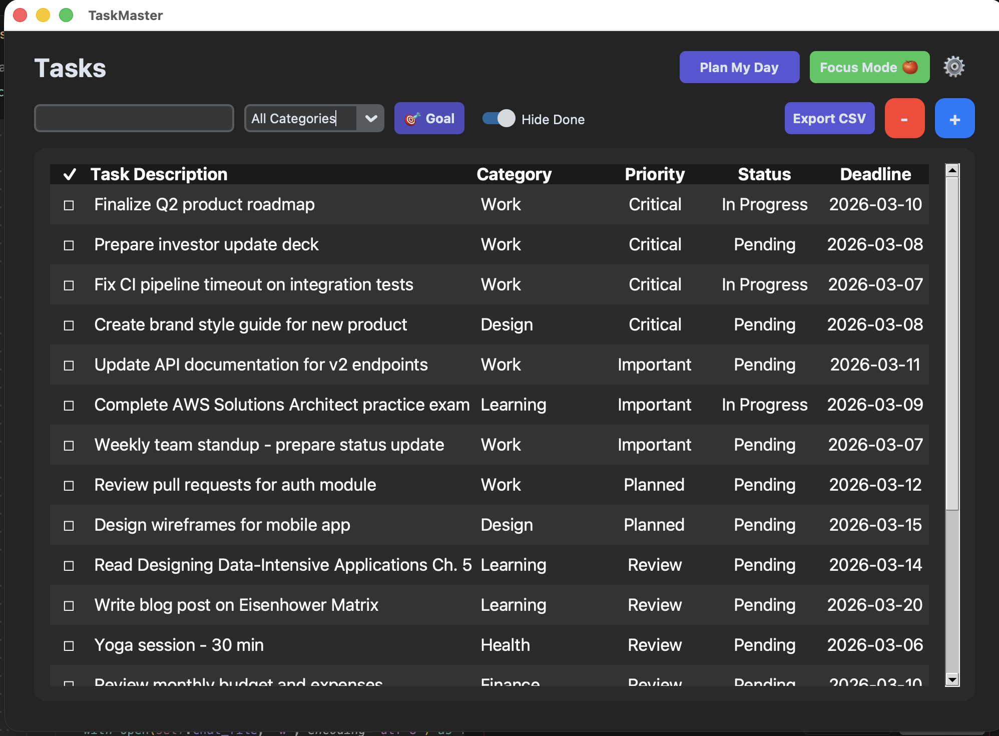
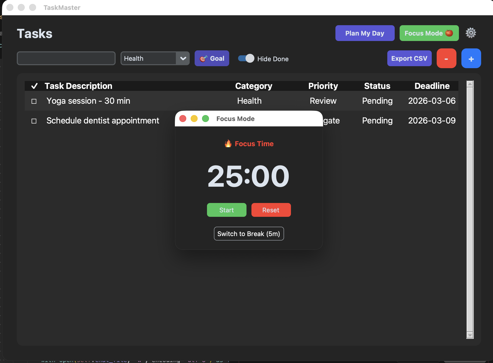
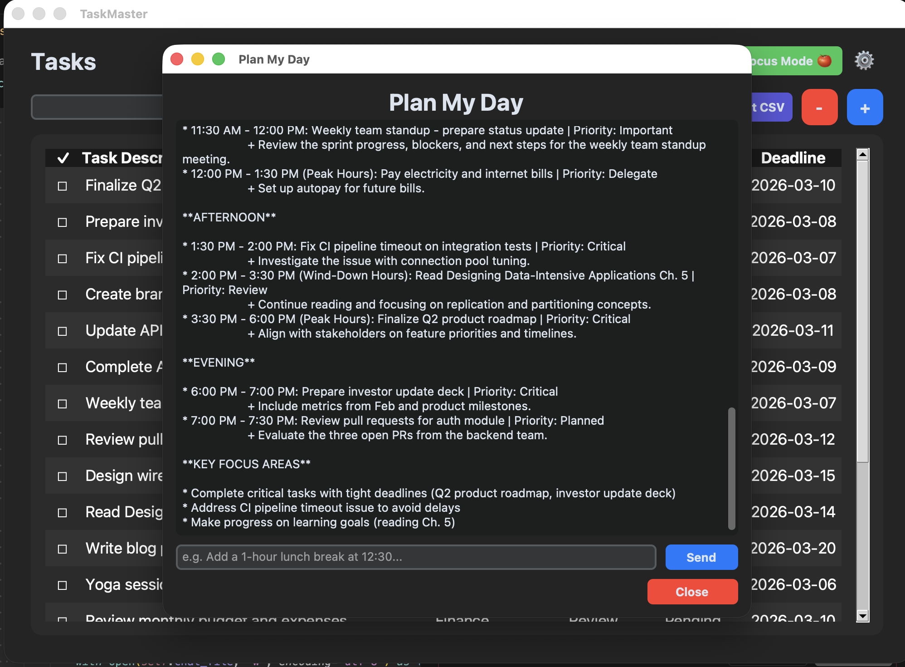
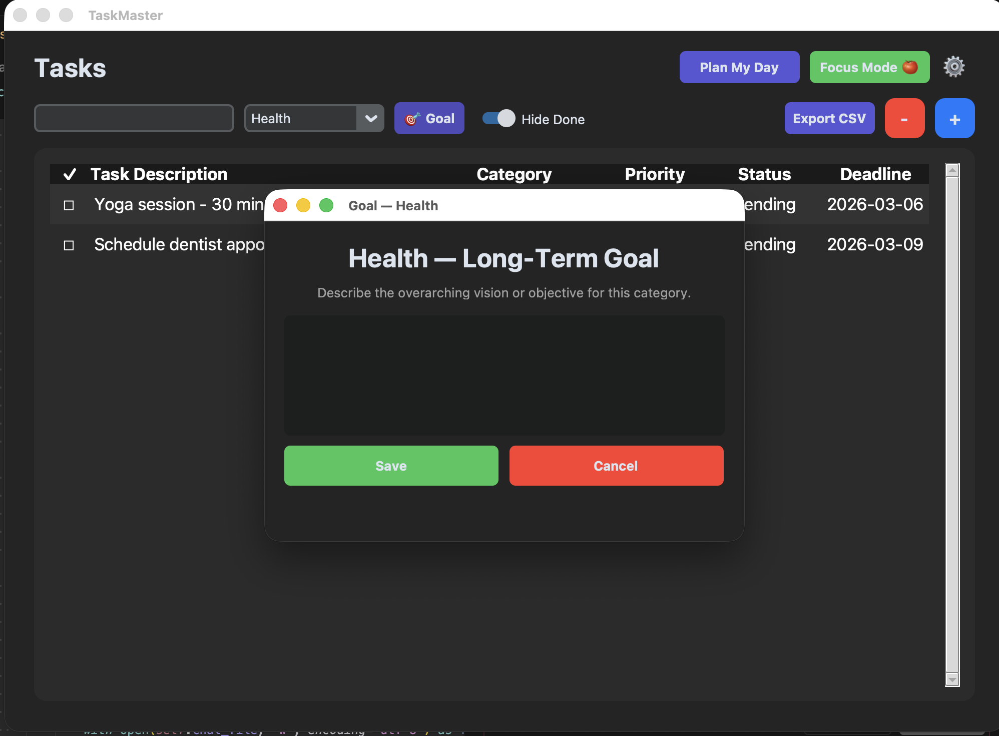
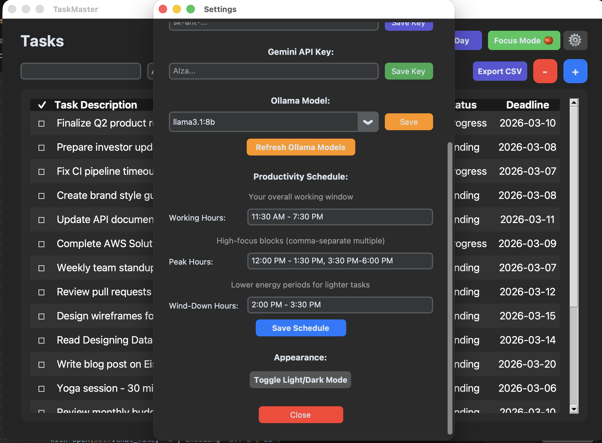

# TaskMaster

<div align="center">
  
  <br>
  <b>A modern, AI-powered task manager built for focus.</b>
  <br><br>
  
  
  
  
</div>

---

## About

**TaskMaster** is a Python desktop application that helps you organize tasks using **Eisenhower Matrix** logic. It automatically calculates task priority based on Impact and Urgency, features an AI-powered day planner, a built-in Pomodoro timer, and a clean native interface with Light/Dark theme support — all with local-first storage.

## Key Features

### Task Management
* **Smart Priority Logic** — Automatically categorizes tasks (Critical, Planned, Important, Review, Delegate, Trivial) based on Impact (High/Medium/Low) and Urgency.
* **Categories & Filters** — Organize tasks by category (Work, Personal, Health, etc.) and filter the view.
* **Search** — Real-time search bar to quickly find tasks by title.
* **Task Notes** — Add detailed notes and descriptions to each task.
* **Hide Completed** — Toggle to instantly clean up your view.
* **CSV Export** — Export all tasks to CSV for backup or analysis.
* **Calendar Integration** — Visual date picker for setting deadlines.
* **Auto-Refresh** — Database is polled every 30 seconds so externally edited tasks appear automatically.

### AI-Powered Day Planning
* **Plan My Day** — Interactive chat interface that uses AI to create a structured, time-blocked daily plan from your pending tasks.
* **Multiple AI Providers** — Choose between **Claude** (Anthropic), **Gemini** (Google), or a local **Ollama** model.
* **Productivity Schedule** — Configure your Working Hours, Peak Hours (high focus), and Wind-Down Hours (lower energy) so the AI plans around your energy levels.
* **Category Goals** — Set long-term goals per category to guide the AI's planning decisions.
* **Conversational** — Follow up with the AI to adjust breaks, reorder tasks, or ask questions about your plan.
* **Chat History** — Conversations are automatically saved as JSON files for future reference.

### Focus Mode
* **Pomodoro Timer** — Built-in 25-minute work / 5-minute break timer with a floating window.
* **Configurable** — Adjust work and break durations via the settings dialog.
* **Desktop Notifications** — Get notified when sessions complete (native notifications on macOS).

### Customization
* **Light / Dark Themes** — Switch themes from Settings; preference persists across sessions.
* **Settings Panel** — Manage database path, AI provider & API keys, Ollama model selection, and productivity schedule from a single window.
* **Local & Private** — All data is stored in a local JSON file. No cloud sync required.

---

## Screenshots

| Main Dashboard | Focus Mode |
|:---:|:---:|
|  |  |

| Plan My Day | Category Goals |
|:---:|:---:|
|  |  |

| Settings |
|:---:|
|  |

---

## Installation

### For macOS Users
1. Go to the [Releases](../../releases) page.
2. Download `TaskMaster_Installer.dmg`.
3. Drag the app to your **Applications** folder.
4. **Note:** Since this app is not signed by Apple, you may need to right-click the app and select **Open** the first time.

### For Windows Users
1. Download `TaskMaster.exe` from Releases.
2. Run the executable directly (no installation required).

---

## Development Setup

### 1. Clone the Repository
```bash
git clone https://github.com/samehta2001/Taskmaster.git
cd Taskmaster
```

### 2. Create a Virtual Environment
```bash
python3 -m venv venv
source venv/bin/activate  # On Windows: venv\Scripts\activate
```

### 3. Install Dependencies
```bash
pip install customtkinter tinydb tkcalendar anthropic google-genai ollama
```

### 4. Run the Application
```bash
python3 taskmaster.py
```

---

## Dependencies

| Package | Purpose |
|---------|---------|
| [customtkinter](https://github.com/TomSchimansky/CustomTkinter) | Modern UI framework |
| [tinydb](https://github.com/msiemens/tinydb) | Lightweight local JSON database |
| [tkcalendar](https://github.com/j4321/tkcalendar) | Calendar widget for date selection |
| [anthropic](https://github.com/anthropics/anthropic-sdk-python) | Claude API client |
| [google-genai](https://github.com/googleapis/python-genai) | Gemini API client |
| [ollama](https://github.com/ollama/ollama-python) | Local LLM via Ollama |

---

## Usage

### Adding a Task
1. Click the **+** button in the main window.
2. Enter task details:
   - **Task Description** — Title of your task
   - **Notes** — Additional details or context
   - **Category** — Organize by Work, Personal, Health, etc.
   - **Status** — Pending, In Progress, Completed, or On Hold
   - **Impact** — High, Medium, or Low
   - **Urgent** — Toggle to mark as urgent
   - **Deadline** — Select a date using the calendar picker
3. Click **Save**.

### Managing Tasks
- **Search** — Use the search bar to filter tasks by title.
- **Filter by Category** — Use the dropdown to view specific categories.
- **Hide Completed** — Toggle the switch to hide finished tasks.
- **Edit Task** — Double-click any task to edit it.
- **Delete Tasks** — Check the box next to tasks and click **-** to delete.
- **Export** — Click **Export CSV** to save your tasks to a CSV file.
- **Category Goals** — Select a category and click **Goal** to set long-term objectives.

### Plan My Day (AI)
1. Configure your AI provider and API key in **Settings**.
2. Set your Working Hours, Peak Hours, and Wind-Down Hours.
3. Optionally set category goals via the **Goal** button.
4. Click **Plan My Day** in the header.
5. The AI generates a structured, time-blocked plan based on your pending tasks and schedule.
6. Chat with the AI to adjust breaks, reorder priorities, or ask follow-up questions.
7. Conversations are auto-saved to `~/Library/Application Support/TaskMaster/plan_chats/` (macOS).

### Focus Mode (Pomodoro Timer)
1. Click **Focus Mode** in the header.
2. Click **Start** to begin a 25-minute work session.
3. Take a 5-minute break when the timer finishes.
4. Adjust durations via the **Settings** button in the timer window.

### Settings
- **Database** — View or change the database file path.
- **AI Provider** — Switch between Claude, Gemini, or Ollama.
- **API Keys** — Enter your Anthropic or Google API keys.
- **Ollama Model** — Select from locally available Ollama models.
- **Productivity Schedule** — Configure Working Hours, Peak Hours, and Wind-Down Hours.
- **Theme** — Toggle between Light and Dark modes.

---

## AI Provider Setup

### Claude (Anthropic)
1. Get an API key from [console.anthropic.com](https://console.anthropic.com/).
2. Enter the key in Settings under "Anthropic API Key".

### Gemini (Google)
1. Get an API key from [aistudio.google.com](https://aistudio.google.com/).
2. Enter the key in Settings under "Gemini API Key".

### Ollama (Local)
1. Install [Ollama](https://ollama.com/) on your machine.
2. Pull a model: `ollama pull llama3.1:8b`
3. Select "Ollama" as the AI provider in Settings and choose your model.

---

## Data Storage

All data is stored locally:
- **Tasks** — JSON file via TinyDB at a user-chosen location.
- **Config** — `~/Library/Application Support/TaskMaster/todo_config.json` (macOS) or `%APPDATA%/TaskMaster/` (Windows).
- **Chat History** — Saved as timestamped JSON files in `plan_chats/` within the app data directory.
- **Category Goals** — Stored in the same TinyDB database as tasks.

No data leaves your machine unless you use a cloud AI provider (Claude or Gemini), in which case only task titles, statuses, and schedule preferences are sent to generate the day plan.

---

## Building from Source

### macOS (.app + DMG)
```bash
pip install pyinstaller pillow
brew install create-dmg
python3 build.py
```

### Windows (.exe)
```bash
pip install pyinstaller pillow
python build_win.py
```

---

## Contributing

Contributions are welcome! Please feel free to submit a Pull Request.

---

## Acknowledgments

Built with [CustomTkinter](https://github.com/TomSchimansky/CustomTkinter), [TinyDB](https://github.com/msiemens/tinydb), [tkcalendar](https://github.com/j4321/tkcalendar), [Anthropic SDK](https://github.com/anthropics/anthropic-sdk-python), [Google GenAI](https://github.com/googleapis/python-genai), and [Ollama Python](https://github.com/ollama/ollama-python).
